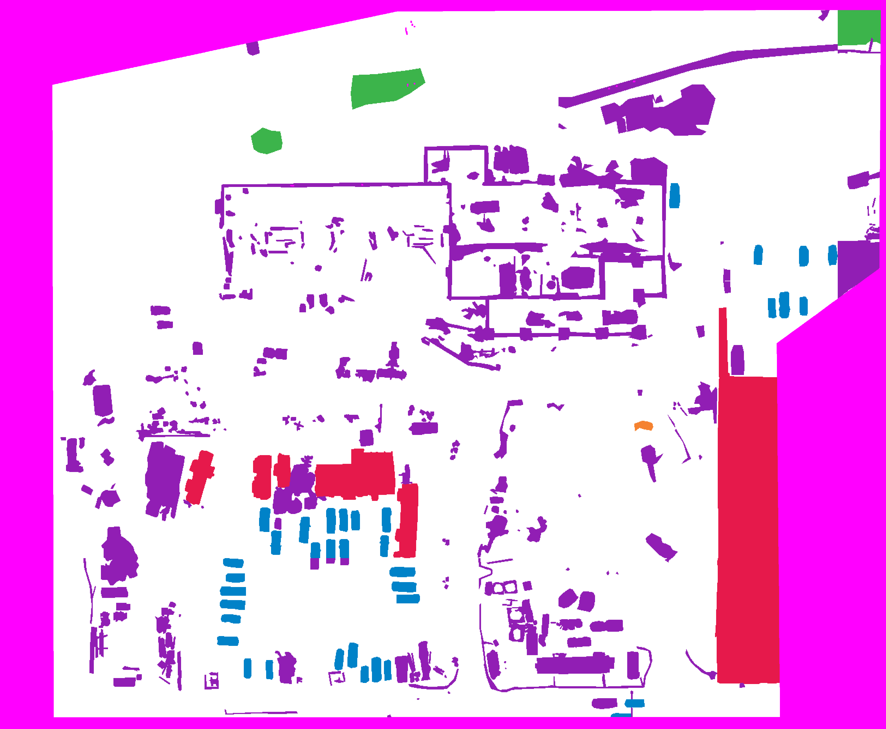

# FSDL Project: AerialSegmentation
<p float="center">
  
  &nbsp; &nbsp; &nbsp; &nbsp;
   
</p>

This is the GIT repository to our Full Stack Deep Learning Final Project. In the Project we worked on the benchmark given at https://wandb.ai/dronedeploy/dronedeploy-aerial-segmentation/benchmark. For a deeper dive into our project please read the [report](FSDL_Report.pdf).

## Installation

Run the setup bash script to install all dependencies.

```bash
bash setup.sh
```

Afterwards run the download_data.py script to download and chip the dataset. This may take a while.

```
python download_data.py
```

## Train
From the project folder run the run_experiment.py script. To replicate the model we submitted to the wandb benchmark, run the the script with the following arguments.

```
python training/run_experiment.py --wandb --batch_size=8 --data_class=AerialData --dataset=dataset-medium --elevation_alpha=10 --encoder_name=mobilenet_v2 --gpus=1 --loss=cross_entropy --lr=0.0001 --model_class=Unet --augmentations hflip vflip rotate
```

## Inference
To run inference use the run_inference_on_split.py script.

```
python training/run_inference_on_split.py --dataset=dataset-medium --run_id=9815f5bz --metric=val_f1 --project=aerialsegmenation-sweeps --size=4000 --smoothing=1 --stride=7 --split test --batchsize=1
```

With the run_id, project and metric flag one can determine the model used for inference. If the run_id flag is not set the best model is searched over all successful runs in the project.


## Submission
For our final submission we used the run_experiment_and_inference.py script. Check out our submitted run by clicking the following link.

https://wandb.ai/team_jf/aerialsegmenation-submission/runs/1mygfkxh/overview?workspace=user-

## License
[MIT](https://choosealicense.com/licenses/mit/)